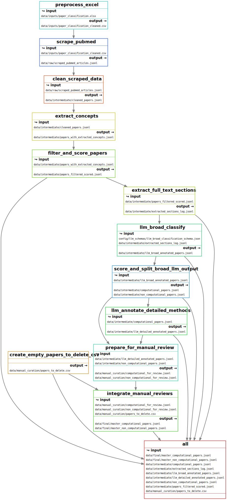

# Spatial Omics Living Review

This repository serves as a living review for the field of spatial omics. 
It aims to continuously update and curate relevant scientific literature, methodologies,
and resources within this rapidly evolving domain.

This project provides an interactive platform for exploring computational neuroscience papers. It leverages semantic similarity to build a dynamic graph, allowing researchers to discover connections, filter by various attributes, and delve into the methodologies discussed in the literature.

 

  <a href="https://marta-seq.github.io/solr/" target="_blank" style="
    display: inline-block;
    padding: 10px 20px;
    margin: 10px;
    background-color: #2ea44f; /* GitHub green */
    color: white;
    text-decoration: none;
    border-radius: 6px;
    font-weight: bold;
    font-family: -apple-system, BlinkMacSystemFont, 'Segoe UI', Helvetica, Arial, sans-serif, 'Apple Color Emoji', 'Segoe UI Emoji';
    box-shadow: 0 4px 6px rgba(0, 0, 0, 0.1);
    transition: background-color 0.3s ease;
  " onmouseover="this.style.backgroundColor='#2c974b'" onmouseout="this.style.backgroundColor='#2ea44f'">
    🚀 View on GitHub Pages
  </a>
  <a href="https://spatialomicslivereview.streamlit.app/" target="_blank" style="
    display: inline-block;
    padding: 10px 20px;
    margin: 10px;
    background-color: #FF4B4B; /* Streamlit red */
    color: white;
    text-decoration: none;
    border-radius: 6px;
    font-weight: bold;
    font-family: -apple-system, BlinkMacSystemFont, 'Segoe UI', Helvetica, Arial, sans-serif, 'Apple Color Emoji', 'Segoe UI Emoji';
    box-shadow: 0 4px 6px rgba(0, 0, 0, 0.1);
    transition: background-color 0.3s ease;
  " onmouseover="this.style.backgroundColor='#e04242'" onmouseout="this.style.backgroundColor='#FF4B4B'">
    💡 Launch Streamlit App
  </a>

[//]: # (![Man in boat on a sea of papers]&#40;figures/img_2.png&#41;)

## About this Living Review

The field of spatial omics, encompassing techniques such as Spatial Transcriptomics,
Imaging Mass Cytometry, and more, generates vast amounts of data and new analytical approaches. A living review provides a dynamic platform to:

* **Track new publications:** Continuously identify and incorporate recently published papers.
* **Summarize key findings:** Provide concise overviews of important breakthroughs and methods.
* **Highlight emerging trends:** Identify and discuss new directions and technologies.
* **Curate resources:** Point to useful tools, software, datasets, and community initiatives.

The focus is on create a roadmap of the available methods to analyse spatial omics data and to 
summarize the current spatial datasets available in the field.

The review is based on the scrap of pubmed, with papers being weakly annotated
by google LLMs to identify relevant papers and categorize methods/applications/tools. 
The entries are then manually curated by the author.

[//]: # (![scheme]&#40;figures/scheme1.png&#41;)

## Contribution

We welcome contributions from the community to help keep this living review up-to-date and comprehensive. If you have relevant papers, resources, or insights to share, please consider:

* Opening an issue to suggest additions or corrections.
* Submitting a pull request with your proposed changes.

## Structure

The living review is organized into several key sections:
TODO

---

**Note:** The image above metaphorically represents the challenge and ongoing 
effort of navigating the vast and ever-growing sea of scientific literature in 
spatial omics to find relevant and valuable information.

[//]: # (![scheme]&#40;figures/scheme1.png&#41;)

